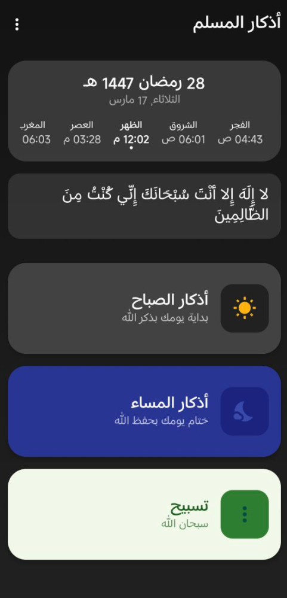

    

# 🌙 Athkar App (تطبيق أذكار المسلم) 


**Athkar App** is a modern, beautifully designed Android application built to help Muslims maintain their daily habits of reading Morning and Evening supplications (Azkar), alongside a digital Tasbeeh counter.

Built entirely with **Kotlin** and **Jetpack Compose**, it features a smooth UI, haptic feedback, dark mode support, and full offline functionality.

## ✨ Key Features
  * 🛜 **Fully Offline which make it safe and with no ADs**
  * 🌅 **Morning & Evening Azkar:** Dedicated, easily accessible lists for daily supplications.
  * 📿 **Smart Tasbeeh Counter:** A beautiful, large-area digital counter with haptic feedback and a quick reset function.
  * ✏️ **Fully Customizable:** Add your own custom Azkar, delete ones you don't need, or seamlessly reorder them via drag-and-drop to fit your routine.
  * 📊 **Progress Tracking:** Tracks your lifetime total reads to keep you motivated.
  * 🌓 **Dynamic Theming:** Built-in Light and Dark modes with smooth transitions to reduce eye strain at night.
  * 📳 **Interactive UI:** Tap-to-count cards with haptic vibrations and smooth animations when finishing a Zikr.
  * 🌐 **Native RTL Support:** Designed from the ground up with right-to-left UI layouts for the Arabic language.

## 📱 Screenshots

> **Note to Developer:** *Replace these placeholder links with actual paths to your repository's images.*

| App Icon | Home Screen | Morning Azkar |
| :---: | :---: | :---: |
|  |  |  |

## 🛠️ Tech Stack & Architecture

This project is built using modern Android development practices:

  * **UI Toolkit:** [Jetpack Compose](https://developer.android.com/jetpack/compose) (Material 3)
  * **Language:** [Kotlin](https://kotlinlang.org/)
  * **Architecture:** Model-View-ViewModel (MVVM)
  * **Concurrency:** Kotlin Coroutines & Flow for asynchronous data handling.
  * **Local Database:** [Room](https://developer.android.com/training/data-storage/room) (SQLite object mapping) to store user progress, custom azkar, and preferences.
  * **Dependency Injection:** Manual DI (via `Application` class & `ViewModelFactory`).
  * **Preferences:** DataStore / SharedPreferences (via `SettingsManager`) for theme and app state management.

## 🚀 Getting Started

### Prerequisites

  * Android Studio Ladybug (or newer recommended)
  * Minimum SDK: API 24 (Adjust based on your actual `build.gradle`)
  * Target SDK: API 34

### Installation
You can Download the APK form Releases or
1.  Clone the repository:
    ```bash
    git clone https://github.com/Pb22j/AthkarApp.git
    ```
2.  Open the project in **Android Studio**.
3.  Let Gradle sync the project's dependencies.
4.  Build and run the app on an emulator or a physical device.

## 📂 Project Structure

A quick look at the core components:

  * `MainActivity.kt`: The main dashboard displaying total reads and navigation cards.
  * `AzkarActivity.kt` / `AzkarComponents.kt`: The core screens for reading, adding, and editing Azkar lists. Includes the Zikr tap mechanics.
  * `TasbeehActivity.kt`: A clean, distraction-free digital counter.
  * `data/`: Contains the `AzkarDatabase`, `AzkarRepository`, Entities, and local Managers (Haptics & Settings).
  * `AzkarViewModel.kt`: Manages the UI state, theme toggling, and bridges the UI with the Room Database.

## 🤝 Contributing

Contributions are what make the open-source community such an amazing place to learn, inspire, and create. Any contributions you make are **greatly appreciated**.

1.  Fork the Project
2.  Create your Feature Branch (`git checkout -b feature/AmazingFeature`)
3.  Commit your Changes (`git commit -m 'Add some AmazingFeature'`)
4.  Push to the Branch (`git push origin feature/AmazingFeature`)
5.  Open a Pull Request

## 📜 License

Distributed under the GPL3v License. See `LICENSE` for more information.
